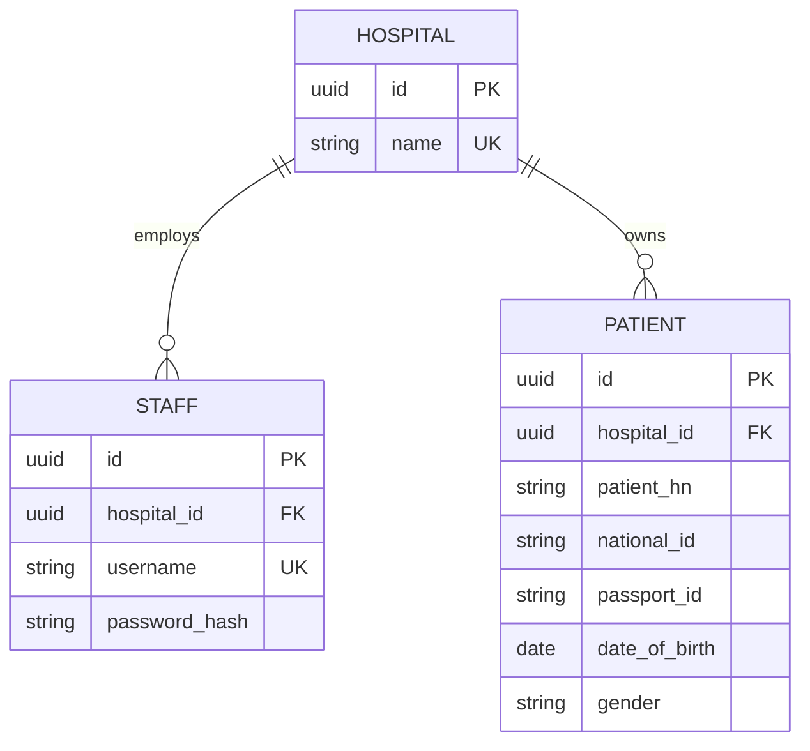

# เอกสารวางแผนระบบ Hospital Middleware

## 1. Project Structure

```text
main.go                 จุดเริ่มต้นและ database migration
router/                  การประกาศ routes
handler/                 HTTP handlers และ request DTOs
middleware/              JWT authentication และ tenant context
models/                  Hospital, Staff, Patient และ base model
db/                     PostgreSQL connection และ migration
nginx/                  reverse proxy configuration
docker-compose.yml       API, Nginx และ PostgreSQL services
```

## 2. API Specification

### สร้าง Staff

`POST /staff/create` รับ `username`, `password`, `hospital` หรือ `hospital_id`
คืน `201` พร้อม `data` ที่มี `id`, `username`, `hospital_id`; username ซ้ำ `409`,
โรงพยาบาลไม่พบ `404`, request ไม่ถูกต้อง `400`

### Login

`POST /staff/login` รับ username, password และ hospital แล้วคืน `200` พร้อม `data.token`.
ข้อมูลไม่ถูกต้องคืน `401`

### ค้นหาผู้ป่วย

`GET /patient/search` ต้องมี Bearer JWT. ทุก query parameter เป็น optional:
`national_id`, `passport_id`, `first_name`, `middle_name`, `last_name`,
`date_of_birth` (YYYY-MM-DD), `phone_number`, `email`. เงื่อนไขหลายตัวใช้ AND
ร่วมกัน และระบบใช้ `hospital_id` จาก JWT ใน query เสมอ จึงค้นข้ามโรงพยาบาลไม่ได้

## 3. ER Diagram



Patient รองรับข้อมูล Hospital A เช่นชื่อไทย/อังกฤษ, HN, national ID, passport ID,
วันเกิด, ช่องทางติดต่อ และ gender (`M`/`F`). การเชื่อมต่อ HIS ภายนอกควรทำผ่าน adapter
หรือ job ที่เก็บข้อมูลลง Patient โดยไม่เปิด credential ของ HIS ผ่าน API สาธารณะ
